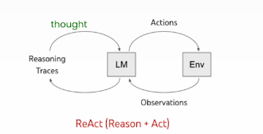

# ReAct Framework (Reason + ACT)

ReAct is a framework where language models (LLMs) such as ChatGPT and Ollama not only provide passive responses, but also act as active agents by calling APIs, handling databases, and interacting with external tools.

## Key Concepts
1. **Reason (Thoughtful):** Generate reasoning traces to explain the agent's thought process.
2. **Act (Action):** Interact with the external environment (e.g., database, tools, APIs) to perform tasks.



---

## Implementation Example: Simple ReAct Agent with Ollama LLM

Below is a summary of the implementation provided in the notebook:

### 1. Environment Setup
- Load environment variables and configure the Ollama model and API URL.

### 2. Agent Class
- Stores the system prompt and message history.
- Interacts with the Ollama LLM to generate responses.

### 3. System Prompt
- Defines the agent's reasoning loop: Thought, Action, PAUSE, Observation, and Answer.
- Specifies available actions (e.g., `calculate`, `average_dog_weight`).

### 4. Action Functions
- Implements functions for agent actions, such as evaluating calculations and returning average dog weights.

### 5. Agent Usage
- Create an agent instance and ask questions to demonstrate reasoning and action.

---

## Example Usage
```python
# Create an instance of the Agent
abot = Agent(prompt)

# Ask the agent a question
result = abot("How much does a toy poodle weigh?")
print(result)
```

---

## References
- [ReAct: Synergizing Reasoning and Acting in Language Models](https://arxiv.org/abs/2210.03629)
- [Ollama LLM Documentation](https://ollama.com/)

---

For full implementation details, see the notebook: `Building_Agents_From_strach.ipynb`.